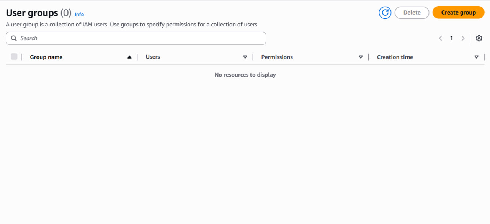
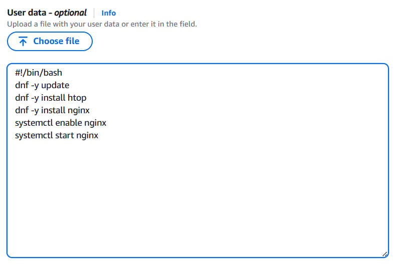

# Лабораторная работа №2: Введение в AWS. Вычислительные сервисы (EC2, IAM, Budgets, Docker)

## Выполнил

* **Студент:** Mihailov Piotr  
* **Группа:** I2302  
* **Дата выполнения:** 12.10.2025  

---

## Цель работы

Целью лабораторной работы является изучение основных вычислительных сервисов **Amazon Web Services (AWS)**, создание и настройка виртуальной машины EC2, управление пользователями через IAM, настройка бюджета расходов, а также развертывание веб-приложения в **Docker-контейнерах** на базе Amazon Linux.

В процессе выполнения студент должен научиться создавать облачные ресурсы, работать с безопасностью и конфигурацией сервисов, устанавливать и настраивать серверное ПО, а также использовать контейнеризацию для развертывания PHP-приложения.

---

## Задание 0. Подготовка среды

### Цель

Создать бесплатный AWS-аккаунт (Free Tier) и выбрать подходящий регион для развёртывания ресурсов.

### Выполнение

1. Перейти на сайт [https://aws.amazon.com](https://aws.amazon.com).  
2. Нажать **“Create an AWS Account”** и пройти регистрацию.  
   Указать email, пароль, имя, адрес и данные банковской карты (для подтверждения Free Tier).  
3. После подтверждения учётной записи войти в **AWS Management Console**.  
4. В правом верхнем углу выбрать регион **EU (Frankfurt)** (`eu-central-1`) — он ближе всего географически и обеспечивает минимальную задержку соединения.

**Результат:**  
Создан рабочий аккаунт AWS с бесплатным тарифом и выбран регион для дальнейшей работы.

---

## Задание 1. Создание IAM группы и пользователя

### Цель:

Изучить систему управления доступом AWS IAM (Identity and Access Management) и создать отдельного пользователя для работы вместо root.

### Выполнение:

1. В консоли AWS открыть сервис **IAM (Identity and Access Management)**.  
2. В левой панели выбрать **User groups → Create group**.

3. Задать имя группы: `Admins`.  
4. На этапе **Attach permissions policies** выбрать политику **AdministratorAccess**.  
   `Эта политика предоставляет полный доступ ко всем сервисам AWS.`  

5. Завершить создание группы.

6. Теперь перейти в раздел **Users → Add user**.  
   - Имя пользователя: `cloudstudent`.  
   
   - Активировать **AWS Management Console access**.  
   - Присвоить пользователя к группе `Admins`.
   

7. Выйти из root-аккаунта и войти в консоль под пользователем `cloudstudent`.


**Результат:**  
Создана группа `Admins` с правами администратора и пользователь `cloudstudent`, использующий эти права.

---

## Задание 2. Настройка Zero-Spend Budget

### Цель:
Настроить систему уведомлений, чтобы получать оповещения, если использование сервисов превысит бесплатный лимит.

### Выполнение:

1. Открыть сервис **Billing and Cost Management**.  
2. В меню слева перейти в **Budgets → Create budget**.  
3. Выбрать шаблон **Zero spend budget**.  
4. Настроить параметры:
   - **Budget name:** ZeroSpend  
   - **Email recipients:** адрес электронной почты для уведомлений  
5. Подтвердить создание, нажав **Create budget**.

**Результат:**  
Создан бюджет ZeroSpend. Теперь AWS будет присылать уведомление, если произойдут какие-либо расходы.


---

## Задание 3. Создание и запуск EC2 экземпляра

### Цель:
Создать виртуальную машину в облаке AWS и автоматически установить базовые сервисы при помощи скрипта User Data.

### Выполнение:

1. Открыть сервис **EC2** и перейти в раздел **Instances → Launch instances**.  
2. Указать параметры:
   - **Name:** webserver  
   - **AMI:** Amazon Linux 2023
     
   - **Instance type:** t3.micro (Free Tier)

   
3. Создать новую пару ключей:
   - **Key pair name:** `mp-keypair`
   - Сохранить файл `mp-keypair.pem` на локальный компьютер.

   
4. Создать **Security Group**:
   - Имя: `webserver-sg`
   - Добавить правила:
     - HTTP (порт 80) — Source: `0.0.0.0/0`
     - SSH (порт 22) — Source: `My IP`
     - TCP (порт 8080) — Source: `0.0.0.0/0`

5. В разделе **Advanced details → User Data** вставить следующий скрипт:

```bash
#!/bin/bash
dnf -y update
dnf -y install nginx docker
systemctl enable nginx
systemctl start nginx
systemctl enable docker
systemctl start docker
```



**Пояснение:**  
User Data позволяет выполнять команды при первом запуске инстанса — здесь автоматически устанавливаются Nginx и Docker.

6. Нажать **Launch instance** и дождаться, пока статус станет **Running** и **2/2 checks passed**.  
7. Скопировать **Public IPv4 address** и открыть в браузере:  

```text
   http://<Public-IP>
```

Отобразится стартовая страница Nginx.


**Результат:**  
Инстанс успешно создан и работает с предустановленными сервисами.

---

## Задание 4. Логирование и мониторинг

### Цель:

Научиться использовать встроенные инструменты мониторинга AWS EC2 и анализировать состояние инстанса.

### Выполнение:

1. Открыть вкладку **Status checks** в панели EC2.  
   Там видно две основные проверки:
   - **System reachability check** — проверяет инфраструктуру AWS.  
   - **Instance reachability check** — проверяет доступность ОС инстанса.  


2. Перейти на вкладку **Monitoring**.  
   Здесь доступны метрики от сервиса **CloudWatch**, такие как:
   - загрузка CPU,
   - сетевой трафик,
   - использование диска.  
   По умолчанию включён **Basic monitoring** (обновление раз в 5 минут).


Детализированный мониторинг включают тогда, когда нужно получать метрики работы сервера каждую минуту, а не раз в пять минут. Это важно для систем, где требуется быстро реагировать на изменения нагрузки и контролировать производительность в реальном времени.

3. Для просмотра логов загрузки выбрать:
   - **Actions → Monitor and troubleshoot → Get system log**.  
   В выводе можно увидеть, как выполнялся User Data скрипт.


4. Для просмотра состояния консоли:
   - **Actions → Monitor and troubleshoot → Get instance screenshot**.  
   Отображается экран, аналогичный подключению к монитору сервера.


**Результат:**  
Мониторинг и логи позволяют отслеживать стабильность и состояние инстанса.

---

## Задание 5. Подключение к EC2 по SSH

### Цель:
Подключиться к инстансу через терминал для ручного управления.

### Выполнение:

1. Открыть терминал на локальном компьютере.  
2. Перейти в директорию, где сохранён ключ:
3. Выполнить подключение:

   ```bash
   ssh -i mihailovp04-student.pem ec2-user@<Public-IP>
   ```

4. После успешного подключения появится приглашение:

```cmd
   [ec2-user@ip-xx-xx-xx-xx ~]$
   ```


5. Проверить, работает ли Nginx:

```bash
   systemctl status nginx
   ```

Если статус “active (running)” — сервер работает корректно.

В AWS нельзя использовать пароль для входа по SSH, потому что это небезопасно — пароль можно подобрать. Вместо этого используется приватный ключ .pem, который обеспечивает шифрованное и уникальное подключение к серверу, защищая систему от несанкционированного доступа.

**Результат:**  
SSH-подключение установлено, инстанс доступен для работы.

---

## Задание 6c. Развёртывание PHP-приложения в Docker

### Цель:
Развернуть полноценное PHP-приложение в контейнерах Docker, включающих веб-сервер, интерпретатор, базу данных и панель администрирования.

### Выполнение:

#### 1. Подготовка рабочей директории

```bash
mkdir ~/php-app && cd ~/php-app
mkdir nginx
```

Эта директория будет содержать файлы приложения и конфигурацию сервера.

---

#### 2. Создание файлов приложения

##### Файл `index.php`

```php
<?php
$host = 'db';
$user = 'root';
$pass = 'password';
$dbname = 'testdb';

$conn = new mysqli($host, $user, $pass, $dbname);
if ($conn->connect_error) {
    die("Ошибка подключения: " . $conn->connect_error);
}

echo "<h1>PHP приложение успешно работает!</h1>";
echo "<p>Подключение к базе данных установлено.</p>";

$conn->close();
?>
```

Этот файл выводит сообщение при успешном подключении к базе данных.

---

##### Файл `nginx/default.conf`

```nginx
server {
  listen 80;
  root /var/www/html;
  index index.php index.html index.htm;

  location / {
    try_files $uri $uri/ =404;
  }

  location ~ \.php$ {
    include fastcgi_params;
    fastcgi_pass php:9000;
    fastcgi_index index.php;
    fastcgi_param SCRIPT_FILENAME $document_root$fastcgi_script_name;
  }
}
```

Файл конфигурации Nginx определяет обработку PHP-запросов и передачу их в PHP-FPM.

---

##### Файл `docker-compose.yml`

```yaml
version: '3.9'
services:
  nginx:
    image: nginx:latest
    container_name: nginx
    ports:
      - "80:80"
    volumes:
      - ./nginx/default.conf:/etc/nginx/conf.d/default.conf
      - ./index.php:/var/www/html/index.php
    depends_on:
      - php
    networks:
      - app-network

  php:
    image: php:8.2-fpm
    container_name: php
    volumes:
      - ./index.php:/var/www/html/index.php
    networks:
      - app-network

  db:
    image: mysql:8.0
    container_name: db
    environment:
      MYSQL_ROOT_PASSWORD: password
      MYSQL_DATABASE: testdb
    volumes:
      - db_data:/var/lib/mysql
    networks:
      - app-network

  adminer:
    image: adminer
    container_name: adminer
    ports:
      - "8080:8080"
    networks:
      - app-network

volumes:
  db_data:

networks:
  app-network:
    driver: bridge
```

**Пояснение:**  

- `nginx` — веб-сервер, принимает HTTP-запросы.  
- `php` — интерпретатор PHP.  
- `db` — база данных MySQL.  
- `adminer` — веб-интерфейс для управления БД.  
- `app-network` — виртуальная сеть, соединяющая контейнеры.  

---

#### 3. Запуск контейнеров

```bash
docker compose up -d
```

Проверка состояния:

```bash
docker ps
```

Результат:
```
CONTAINER ID   IMAGE         STATUS         PORTS
xxxxxx         nginx:latest  Up 2 minutes   0.0.0.0:80->80/tcp
xxxxxx         adminer       Up 2 minutes   0.0.0.0:8080->8080/tcp
```

---

#### 4. Проверка работы приложения

1. В браузере открыть:
   ```
   http://<Public-IP>
   ```
   Отобразится страница:
   **“PHP приложение успешно работает! Подключение к базе данных установлено.”**


2. Перейти по адресу:

   ```text
   http://<Public-IP>:8080
   ```

Откроется веб-интерфейс **Adminer**.


---

### Результат:

Приложение успешно развернуто.  
Nginx обрабатывает HTTP-запросы, PHP-FPM выполняет PHP-код, MySQL хранит данные,  
а Adminer обеспечивает удобный графический интерфейс для управления базой.

---

## Задание 7. Завершение работы

### Цель:
Корректно завершить работу и остановить инстанс EC2.

### Выполнение:

1. В консоли AWS выбрать свой инстанс EC2.  
2. Нажать **Instance state → Stop instance**.  
3. Подтвердить остановку.

**Пояснение:**  

- **Stop** — инстанс останавливается, но данные сохраняются.  
- **Terminate** — инстанс удаляется вместе с диском.

**Результат:**  
Ресурсы остановлены, данные и настройки сохранены.

---

## Вывод

В ходе выполнения лабораторной работы я:

- Освоил работу с основными вычислительными сервисами AWS (EC2, IAM, Budgets, CloudWatch).  
- Научился создавать и настраивать виртуальные машины.  
- Автоматизировал установку программ через User Data.  
- На практике развернул PHP-приложение с использованием Docker и Docker Compose.  
- Организовал взаимодействие между Nginx, PHP, MySQL и Adminer в контейнерах.  
- Остановил инстанс без потери данных.

Все цели лабораторной работы достигнуты. Приложение работает корректно, а навыки работы с AWS и Docker успешно закреплены.

---

## Библиография

1. [AWS EC2 Documentation](https://docs.aws.amazon.com/ec2/)  
2. [AWS IAM Documentation](https://docs.aws.amazon.com/iam/)  
3. [Docker Documentation](https://docs.docker.com/)  
4. [Nginx Beginner’s Guide](https://nginx.org/en/docs/beginners_guide.html)  
5. [PHP Manual](https://www.php.net/manual/en/)  
6. [Adminer Documentation](https://www.adminer.org/en/)  
7. [AWS CloudWatch Documentation](https://docs.aws.amazon.com/cloudwatch/)
