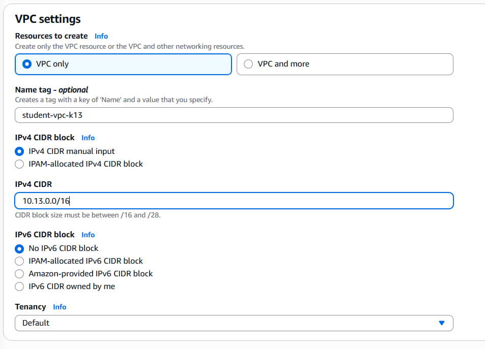
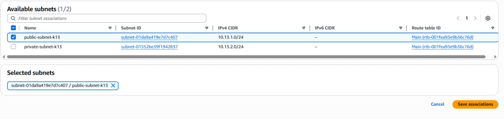
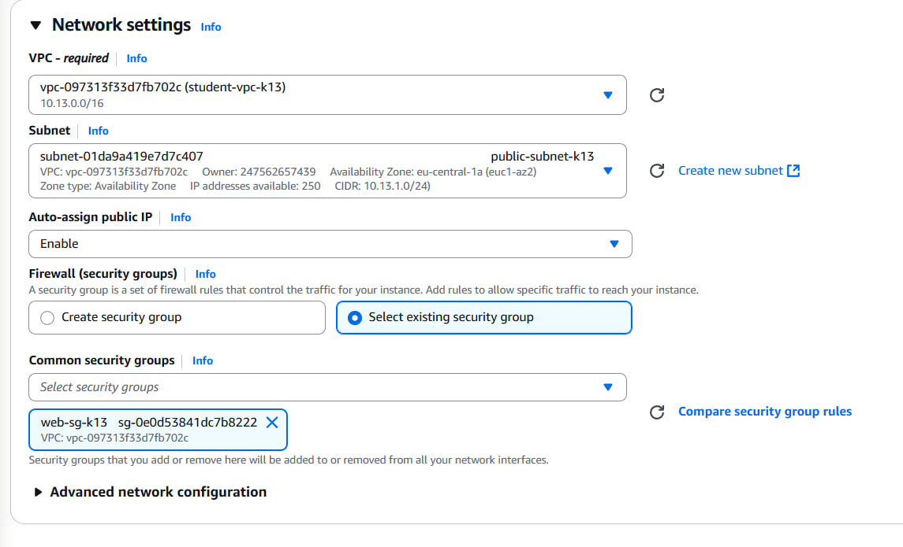

# Лабораторная работа №3: Облачные сети

## Выполнил

* **Студент:** Mihailov Piotr  
* **Группа:** I2302  
* **Дата выполнения:** 19.10.2025  

## Цель работы

Создать изолированную сеть в **AWS VPC**, настроить публичную и приватную подсети, **Internet Gateway (IGW)** и **NAT Gateway**, таблицы маршрутов, группы безопасности (**Security Groups**), развернуть три **EC2**‑инстанса (web, db, bastion) и проверить взаимодействие: доступ к веб‑серверу из интернета и доступ к базе данных **только через bastion**. В процессе ответить на контрольные вопросы по ходу выполнения.

## Задание 1. Подготовка среды

**Цель:** выбрать рабочий регион и открыть необходимые инструменты.

**Выполнение:**

1. **Выбор региона:**  
   В AWS Management Console в правом верхнем углу был выбран регион **EU (Frankfurt) — eu-central-1**, так как он поддерживает уровень Free Tier и находится ближе географически.

2. **Открытие консоли VPC:**  
   Через меню **Services → Networking & Content Delivery → VPC** была открыта консоль **VPC (Virtual Private Cloud)**, где далее будут создаваться сеть, подсети и маршрутизация.

## Задание 2. Создание VPC

**Цель:** развернуть изолированную виртуальную сеть (Virtual Private Cloud), в которой далее будут создаваться подсети и другие сетевые ресурсы.

**Выполнение:**

1. В консоли VPC перейти в раздел **Your VPCs → Create VPC**.
2. В поле `Name tag` указать: **student-vpc-k13**.
3. В поле `IPv4 CIDR` задать диапазон: **10.13.0.0/16**.
4. В параметре `Tenancy` выбрать режим: **Default**.
5. Нажать кнопку **Create VPC**.



**Ответы на вопросы:**

- **Что обозначает маска `/16`?**  
  Она указывает, что первые 16 бит адреса фиксированы, а оставшиеся используются для хостов. Это даёт диапазон примерно из **65 536 IP-адресов** (10.13.0.0–10.13.255.255), чего достаточно для учебных сценариев.

- **Почему нельзя использовать `/8`?**  
  Маска `/8` предоставила бы слишком большой диапазон (~16 млн адресов), который:
  - **не поддерживается** при создании VPC в AWS;
  - может конфликтовать с внутренними сетями AWS;
  - нарушает best practices по управлению адресным пространством.

## Задание 3. Internet Gateway (IGW)

**Цель:** обеспечить выход ресурсов из публичной подсети в Интернет через интернет-шлюз.

**Выполнение:**

1. В разделе **Internet Gateways → Create internet gateway** создать IGW с именем: **student-igw-k13**.


2. После создания выбрать **Actions → Attach to VPC** и прикрепить шлюз к VPC: **student-vpc-k13**.


## Задание 4. Подсети (Subnets)

**Цель:** разделить ресурсы по зонам доступности и назначению: публичная для внешних сервисов, приватная — для внутренних ресурсов.

### 4.1 Публичная подсеть

При создании указываем следующие параметры:

- **Subnet name:** `public-subnet-k13`  
- **VPC:** `student-vpc-k13`  
- **Availability Zone (AZ):** `eu-central-1a`  
- **IPv4 CIDR:** `10.13.1.0/24`


**Вопрос:** Является ли подсеть публичной на данном этапе?  
**Ответ:** Нет. Подсеть пока остаётся приватной, т.к. к ней не привязана таблица маршрутов с правилом `0.0.0.0/0 → IGW`.

### 4.2 Приватная подсеть

При создании указываем:

- **Subnet name:** `private-subnet-k13`  
- **Availability Zone:** `eu-central-1b`  
- **IPv4 CIDR:** `10.13.2.0/24`


**Вопрос:** Считается ли эта подсеть приватной сейчас?  
**Ответ:** Да, фактически она является приватной, поскольку не имеет маршрута в Интернет. Доступ наружу в дальнейшем будет осуществляться через NAT.

## Задание 5. Таблицы маршрутов (Route Tables)

**Цель:** определить правила направления сетевого трафика для публичной и приватной подсетей.

### 5.1 Публичная таблица маршрутов

**Шаги:**

1. Перейти в раздел **Route Tables → Create route table** и создать таблицу с именем: **public-rt-k13**, выбрав VPC: `student-vpc-k13`.


2. Открыть вкладку **Routes → Edit routes → Add route** и добавить правило:
   - **Destination:** `0.0.0.0/0`  
   - **Target:** **Internet Gateway** → `student-igw-k13`


3. Перейти в раздел **Subnet associations → Edit** и привязать таблицу к подсети: `public-subnet-k13`.



**Вопрос:** Зачем привязывать таблицу к подсети?  
**Ответ:** Без привязки подсеть продолжит использовать **основную таблицу по умолчанию**, и новые правила не будут применяться.

### 5.2 Приватная таблица маршрутов

**Шаги:**

1. Создать таблицу маршрутов: **private-rt-k13**.


2. Перейти в **Subnet associations → Edit** и привязать к подсети: `private-subnet-k13`.
3. На данном этапе маршрут `0.0.0.0/0` не добавляется — он будет добавлен позже после создания NAT.


## Задание 6. NAT Gateway

**Цель:** предоставить приватной подсети исходящий доступ в Интернет без изменения её закрытого статуса.

**Вопрос** Как работает NAT Gateway?

**Ответ** NAT Gateway — это сервис AWS, который позволяет ресурсам из приватной подсети выходить в Интернет без публичного IP. Он подменяет приватный IP-адрес исходящего запроса на свой публичный, отправляет его во внешний интернет и возвращает ответ обратно. Входящие подключения снаружи не допускаются. Создаётся в публичной подсети и указывается в маршрутной таблице приватной подсети как точка выхода в Интернет.

### 6.1 Выделение Elastic IP

Перейти в раздел **Elastic IPs → Allocate Elastic IP address** и нажать **Allocate**.  
Этот IP будет использоваться NAT-шлюзом для исходящего трафика.


### 6.2 Создание NAT Gateway

При создании указать:

- **Name:** `nat-gateway-k13`  
- **Subnet:** `public-subnet-k13` (NAT всегда размещается в публичной подсети)  
- **Connectivity type:** Public  
- **Elastic IP:** адрес, выделенный на шаге 6.1  


После заполнения нажать **Create NAT gateway** и дождаться статуса **Available**.


### 6.3 Добавление маршрута в приватную таблицу

Перейти: **Route Tables → private-rt-k13 → Routes → Edit** и добавить правило:

- **Destination:** `0.0.0.0/0`  
- **Target:** **NAT Gateway → nat-gateway-k13**


## Задание 7. Security Groups (SG)

**Цель:** ограничить доступ на уровне инстансов.

**Созданы 3 SG в VPC `student-vpc-k13`:**

1. **`web-sg-k13`** — Inbound:  
   - HTTP 80 → `0.0.0.0/0`  
   - HTTPS 443 → `0.0.0.0/0`


2. **`bastion-sg-k13`** — Inbound:  
   - SSH 22 → **My IP** 


3. **`db-sg-k13`** — Inbound:  
   - MySQL/Aurora 3306 → **`web-sg-k13`**  
   - SSH 22 → **`bastion-sg-k13`**


**Контрольный вопрос: Что такое Bastion Host и зачем он нужен?**  
**Ответ:** Публичный «шлюз» для админдоступа в приватную сеть. Снижаем поверхность атаки: открываем SSH только на bastion, а приватные сервера доступны **только** изнутри через него.

## Задание 8. EC2-инстансы (web, db, bastion)

**Цель:** развернуть три виртуальных сервера (EC2), настроить их роли и автоматизировать установку необходимого ПО через User Data.

### Общие параметры (для всех инстансов)

- AMI: **Amazon Linux 2023**
- Тип: `t3.micro` (Free Tier)
- SSH Key Pair: `student-key-k13`
- VPC: `student-vpc-k13`


### 8.1 Web-сервер (публичная подсеть)

**Параметры:**

- Subnet: `public-subnet-k13`
- Назначение публичного IP: **Enable**
- Security Group: `web-sg-k13`



**User Data (установка Apache и PHP):**

```bash
#!/bin/bash
dnf install -y httpd php
echo "<?php phpinfo(); ?>" > /var/www/html/index.php
systemctl enable httpd
systemctl start httpd
```

Результат: Web-сервер развернут в публичной подсети и настроен на автоматический запуск Apache с тестовой PHP-страницей.

### 8.2 DB-сервер (приватная подсеть)

**Параметры:**

- Subnet: `private-subnet-k13`
- Назначение публичного IP: **Disable**
- Security Group: `db-sg-k13`


**User Data (установка MariaDB и установка пароля для root):**

```bash
#!/bin/bash
dnf install -y mariadb105-server
systemctl enable mariadb
systemctl start mariadb
mysql -e "ALTER USER 'root'@'localhost' IDENTIFIED BY 'StrongPassword123!'; FLUSH PRIVILEGES;"
```

Результат: сервер базы данных развернут в приватной подсети и получил доступ к Интернету через NAT. MariaDB установлена и настроен пароль суперпользователя.

### 8.3 Bastion-host (публичная подсеть)

**Параметры:**

- Subnet: `public-subnet-k13`
- Назначение публичного IP: **Enable**
- Security Group: `bastion-sg-k13`


**User Data (установка клиента MariaDB для подключения к БД):**

```bash
#!/bin/bash
dnf install -y mariadb105
```

## Задание 9. Проверка схемы и подключение к БД

**Цель:** убедиться, что публичная подсеть работает через IGW, приватная — изолирована, а доступ к БД ограничен.

### Выполнение

#### 1. Проверка доступа к веб-серверу

1. Копируем **Public IP** веб-сервера (`web-server`).
2. В браузере переходим по `http://<Public-IP>`.
3. Если User Data выполнен, отображается страница `phpinfo()`.

Результат: Веб-сервер доступен — публичная подсеть и IGW работают.


#### 2. Подключение к bastion

```bash
ssh -i student-key-k13.pem ec2-user@<Bastion-Public-IP>
```

Результат: Есть SSH-доступ — значит bastion настроен в публичной подсети.

#### 3. Проверка выхода в Интернет на bastion

```bash
ping -c 4 google.com
```

Результат: Ответы приходят — IGW настроен корректно.


#### 4. Попытка подключиться к базе данных напрямую с bastion

```bash
mysql -h <DB-Private-IP> -u root -p
```

Ошибка:

```err
ERROR 2002 (HY000): Can't connect to MySQL server on '10.13.2.xxx' (115)
```

Причина: Security Group `db-sg-k13` разрешает порт 3306 **только из `web-sg-k13`**, а мы подключаемся с bastion.

## Задание 10. Доступ к приватной подсети через Bastion (SSH Jump + Agent Forwarding)

**Цель:** подключиться на `db-server` без публикации его в Интернет.

### Выполнение

#### 1. Активируем ssh-agent на Windows PowerShell

```powershell
Set-Service ssh-agent -StartupType Automatic
Start-Service ssh-agent
ssh-add "D:\path\to\student-key-k13.pem"
```

Теперь bastion сможет «использовать» наш ключ, без его копирования.

#### 2. Подключаемся на db-server через bastion

```bash
ssh -A -J ec2-user@<Bastion-Public-IP> ec2-user@<DB-Private-IP>
```


Результат: мы оказались прямо в приватной машине (db-server), как будто у неё есть публичный IP.

**Вопрос** Что делает опция -A и -J?

**Ответ** -J (ProxyJump) — осуществляет «прыжок» через bastion-host, то есть сначала подключение идёт к бастиону, а затем через него — к целевому приватному серверу.

-A (Agent Forwarding) — перенаправляет SSH-агент с локального устройства, позволяя использовать локальный ключ на удалённом сервере (ключ не копируется на bastion).

#### 3. Проверяем NAT из приватной подсети

```bash
sudo dnf update -y
```


```bash
sudo dnf install -y htop
```


Результат: обновления устанавливаются — NAT Gateway работает.

#### 4. Подключаемся к MySQL локально

```bash
mysql -u root -p
# пароль: StrongPassword123!
```


Результат: root работает только локально — по правилам безопасности.

**Вывод по безопасности:** root‑доступ оставляем только с `localhost`. Для приложений создаются отдельные пользователи с ограниченным источником (например, только из `web-sg-k13`).

## Завершение работы и контроль затрат

**Удаляю в порядке:**

1. **EC2** (web, db, bastion).  
2. **NAT Gateway** (платный ресурс).  
3. **Elastic IP** (Release).  
4. Ненужные **Security Groups**, **Route Tables**, **Subnets**.  
5. **Internet Gateway** (Detach → Delete).  
6. **VPC** (после удаления зависимостей).

Чтобы не было списаний, достаточно удалить **EC2**, **NAT Gateway** и освободить **Elastic IP**. VPC/подсети/RT/SG отдельно не тарифицируются.

## Вывод

В ходе выполнения лабораторной работы №3 была разработана и практически реализована полная облачная сеть на базе AWS, включающая виртуальную частную сеть (VPC) с адресным пространством 10.13.0.0/16, публичную и приватную подсети, интернет-шлюз (IGW), NAT Gateway, таблицы маршрутов и группы безопасности.
Были развернуты три EC2-инстанса: веб-сервер с HTTP-доступом из интернета, сервер базы данных, изолированный в приватной подсети, а также bastion host, обеспечивающий безопасный SSH-доступ к внутренним ресурсам.
Корректность работы инфраструктуры подтверждена: веб-сервер доступен по публичному IP, NAT предоставляет приватной подсети исходящее соединение, а доступ к MySQL возможен только через bastion.
Данная архитектура соответствует принципам безопасной трёхзвенной инфраструктуры с разделением ролей и контролем доступа на уровне сетевых маршрутов и Security Groups. В результате я освоил создание VPC, настройку маршрутизации, работу с IGW и NAT, конфигурацию Security Groups, развертывание EC2-инстансов, а также механизм SSH Jump и Agent Forwarding для доступа в приватную подсеть.
Цель работы полностью достигнута, построенная сеть работоспособна, безопасна и соответствует заданию.

## Список источников

1. AWS VPC Documentation — https://docs.aws.amazon.com/vpc/  
2. Amazon EC2 Documentation — https://docs.aws.amazon.com/ec2/  
3. Security Groups — https://docs.aws.amazon.com/vpc/latest/userguide/VPC_SecurityGroups.html  
4. NAT Gateway — https://docs.aws.amazon.com/vpc/latest/userguide/vpc-nat-gateway.html  
5. Internet Gateway — https://docs.aws.amazon.com/vpc/latest/userguide/VPC_Internet_Gateway.html  
6. Amazon Linux — https://docs.aws.amazon.com/linux/  
7. OpenSSH for Windows — https://learn.microsoft.com/windows-server/administration/openssh/openssh_install_firstuse
