# Лабораторная работа №6

## Балансирование нагрузки и авто‑масштабирование в AWS

**Студент:** Mihailov Piotr,I2302

# 1. Цель работы

Цель данной лабораторной работы — построение полноценной отказоустойчивой и автоматически масштабируемой веб‑инфраструктуры в AWS. В ходе выполнения студент получает практический опыт:

* создания виртуальной сети (VPC) с публичными и приватными подсетями;
* запуска EC2‑инстанса с автоматической конфигурацией через User Data;
* развёртывания веб‑сервера (Nginx + PHP‑FPM);
* создания AMI и Launch Template;
* построения Application Load Balancer (ALB) и Target Group;
* настройки Auto Scaling Group (ASG) на основе метрик CloudWatch;
* проведения нагрузочного тестирования и анализа поведения системы;
* удаления всех ресурсов для предотвращения биллинга.

Работа моделирует реальный кейс DevOps‑инженера по созданию эластичной и отказоустойчивой облачной архитектуры.

# 2. Постановка задачи

Необходимо выполнить следующие действия:

1. Создать VPC с публичными и приватными подсетями.
2. Запустить EC2‑инстанс, автоматически установить Nginx и PHP через User Data.
3. Создать AMI на основе EC2.
4. Создать Launch Template.
5. Создать Target Group.
6. Создать Application Load Balancer.
7. Создать Auto Scaling Group и прикрепить её к ALB.
8. Настроить Target Tracking Policy по CPU.
9. Выполнить нагрузочное тестирование.
10. Проверить автоматическое масштабирование через CloudWatch.
11. Очистить ресурсы.

# 3. Ход выполнения работы

## Шаг 1. Создание VPC и подсетей

**Цель шага:** подготовить изолированную виртуальную сеть, в которой будут развёрнуты все компоненты (EC2, ALB, ASG).

### 1.1. Создание VPC

1. В консоли AWS перейти в раздел **VPC → Your VPCs → Create VPC**.
2. Выбрать режим **VPC only**.
3. Задать параметры:

   * Name: `project-vpc-lab6`
   * IPv4 CIDR: `10.0.0.0/16`
4. Нажать **Create VPC**.

В результате создаётся собственная виртуальная сеть, полностью изолированная от других сетей AWS.

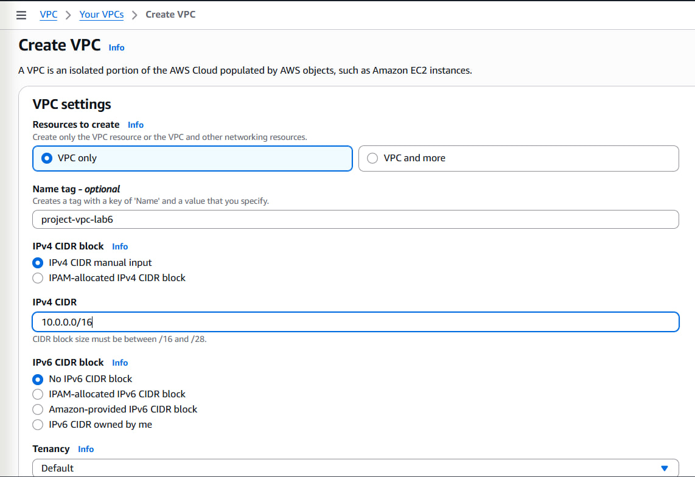

### 1.2. Создание публичных и приватных подсетей

1. Перейти в **Subnets → Create subnet**.
2. Для VPC `project-vpc-lab6` создать 4 подсети:

| Тип     | Название            | AZ         | CIDR         |
| ------- | ------------------- | ---------- | ------------ |
| Public  | `public-subnet-1a`  | us-east-1a | 10.0.1.0/24  |
| Public  | `public-subnet-1b`  | us-east-1b | 10.0.2.0/24  |
| Private | `private-subnet-1a` | us-east-1a | 10.0.11.0/24 |
| Private | `private-subnet-1b` | us-east-1b | 10.0.12.0/24 |

Публичные подсети будут использоваться для размещения Application Load Balancer, приватные — для инстансов Auto Scaling Group.

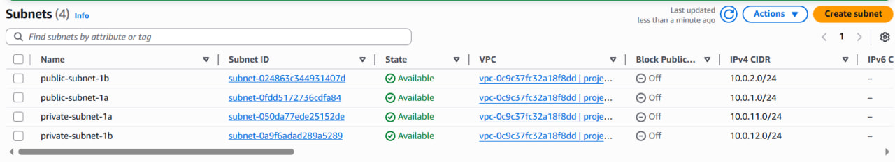

### 1.3. Создание и привязка Internet Gateway

1. В разделе **Internet Gateways → Create internet gateway** создать IGW с именем `project-igw-lab6`.
2. Через **Actions → Attach to VPC** прикрепить IGW к `project-vpc-lab6`.

Internet Gateway позволяет ресурсам в публичных подсетях выходить в интернет.

### 1.4. Настройка таблицы маршрутов для публичных подсетей

1. В разделе **Route tables → Create route table** создать таблицу `public-rt-lab6` для VPC `project-vpc-lab6`.
2. Вкладка **Routes → Edit routes**:

   * Добавить маршрут: Destination `0.0.0.0/0` → Target: Internet Gateway (`project-igw-lab6`).
3. Вкладка **Subnet associations → Edit subnet associations**:

   * Отметить `public-subnet-1a` и `public-subnet-1b`.

Публичные подсети теперь имеют выход в интернет через IGW, приватные остаются изолированными.

## Шаг 2. Создание и настройка виртуальной машины (EC2)

**Цель шага:** запустить виртуальный сервер с Nginx + PHP, который будет основой для AMI и Auto Scaling.

### 2.1. Создание Security Group для веб-сервера

1. Перейти в **EC2 → Security Groups → Create security group**.
2. Параметры:

   * Name: `web-sg-lab6`
   * VPC: `project-vpc-lab6`
3. Inbound rules:

   * SSH (порт 22) — Source: My IP
   * HTTP (порт 80) — Source: 0.0.0.0/0
4. Outbound rules: оставить `All traffic → 0.0.0.0/0`.

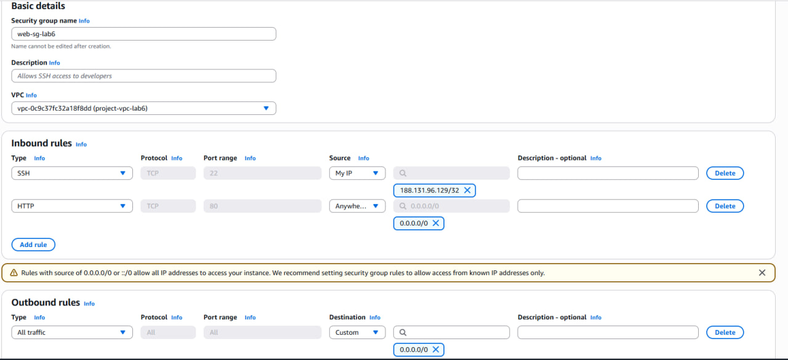

### 2.2. Запуск EC2-инстанса

1. В разделе **EC2 → Instances → Launch instance** задать:

   * Name: `lab6-web-instance`
   * AMI: **Amazon Linux 2023**
   * Instance type: `t3.micro`
   * Key pair: существующий или новый для SSH-доступа
2. Network settings:

   * VPC: `project-vpc-lab6`
   * Subnet: `public-subnet-1a`
   * Auto-assign public IP: **Enable**
   * Security group: `web-sg-lab6`
3. **Advanced details → Monitoring**: включить **Detailed CloudWatch monitoring**.
4. В поле **User data** вставить подготовленный скрипт установки Nginx + PHP.
5. Нажать **Launch instance**.

После запуска дождаться, пока статус проверки станет `2/2 checks passed`, затем открыть в браузере `http://<PUBLIC_IP>/` и убедиться, что страница загружается.

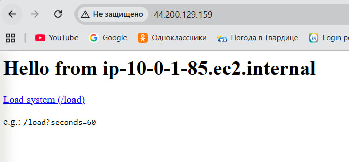

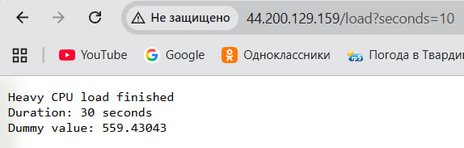

## Шаг 3. Создание AMI

**Цель шага:** сохранить состояние настроенного веб-сервера в виде образа, который можно многократно использовать для новых инстансов.

### 3.1. Создание образа (AMI)

1. В разделе **EC2 → Instances** выбрать `lab6-web-instance`.
2. Через **Actions → Image and templates → Create image** создать AMI:

   * Name: `project-web-server-ami`
   * Description: образ Amazon Linux 2023 с Nginx + PHP и страницей /load.
3. Нажать **Create image** и дождаться, пока в разделе **AMIs** статус образа станет `available`.

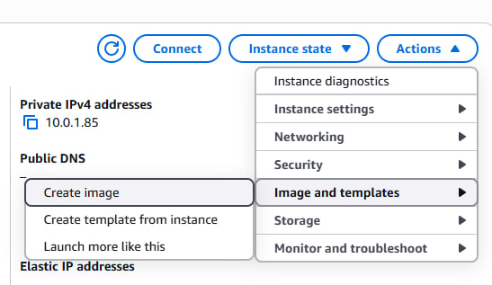

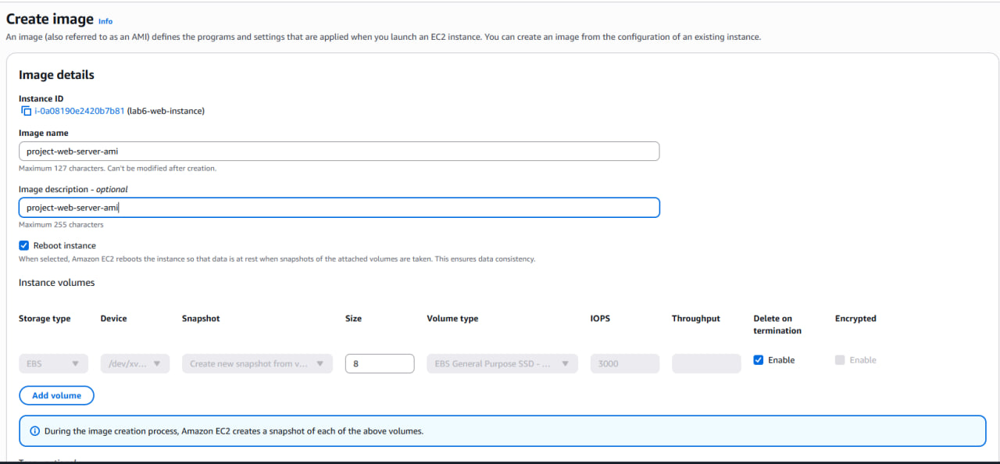

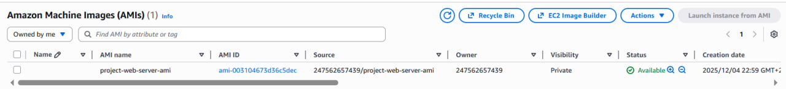

### Контрольный вопрос 1

**Что такое image и чем он отличается от snapshot? Какие есть варианты использования AMI?**

* **Image (AMI)** — это шаблон виртуальной машины, в котором описаны:

  * базовая операционная система;
  * установленное программное обеспечение (в нашем случае Nginx + PHP);
  * конфигурация томов (EBS) и параметры запуска.
* **Snapshot** — это снимок конкретного EBS-диска в определённый момент времени. Он содержит только данные тома, но не всю конфигурацию виртуальной машины.

**Отличия:**

* AMI может ссылаться на один или несколько snapshots и содержит дополнительную метаинформацию (типы устройств, точку запуска и т.п.).
* Snapshot сам по себе не является полноценным образом машины, его нужно ещё «обернуть» в AMI.

**Варианты использования AMI:**

* быстрое развёртывание одинаковых веб-серверов;
* создание Auto Scaling Group, где новые EC2 запускаются из одной AMI;
* версионирование приложений (AMI v1, v2 и т.д.);
* перенос готовой конфигурации в другой регион.

## Шаг 4. Создание Launch Template

**Цель шага:** описать шаблон запуска EC2-инстансов, на основе которого Auto Scaling Group будет поднимать новые виртуальные машины.

### 4.1. Создание Launch Template

1. Перейти в **EC2 → Launch Templates → Create launch template**.
2. Параметры:

   * Name: `project-launch-template`
   * Template version description: `v1`
3. Application and OS Images:

   * AMI: `project-web-server-ami` (ранее созданный образ)
4. Instance type: `t3.micro`.
5. Key pair: тот же, что и для базового инстанса.
6. Network settings:

   * Security groups: `web-sg-lab6`.
7. Advanced details:

   * Detailed CloudWatch monitoring: **Enable**.
8. Нажать **Create launch template**.

### Контрольный вопрос 2

**Что такое Launch Template и зачем он нужен? Чем он отличается от Launch Configuration?**

**Launch Template** — это объект, в котором собраны параметры запуска EC2-инстанса: AMI, тип, ключ, security groups, user data и т.д. Он используется Auto Scaling Group и другими сервисами для стандартизированного создания виртуальных машин.

**Зачем нужен:**

* позволяет один раз описать конфигурацию и использовать её многократно;
* уменьшает количество ручных ошибок при запуске инстансов;
* упрощает управление версиями конфигурации.

**Отличия от Launch Configuration:**

* Launch Template поддерживает **версии** (v1, v2 и т.д.), можно обновлять конфигурацию без пересоздания объекта;
* поддерживает больше функционала (Spot-инстансы, дополнительные параметры сетей и дисков);
* Launch Configuration считается устаревшим и не рекомендуется для новых систем.

## Шаг 5. Создание Target Group

**Цель шага:** создать группу целей, в которой будут регистрироваться EC2-инстансы и по которой ALB будет распределять трафик.

### 5.1. Создание Target Group

1. Перейти в **EC2 → Target Groups → Create target group**.
2. Параметры:

   * Target type: **Instances**
   * Name: `project-target-group`
   * Protocol: HTTP
   * Port: 80
   * VPC: `project-vpc-lab6`
3. Health checks оставить по умолчанию (`/`).
4. Нажать **Next**, не регистрировать инстансы вручную (это сделает ASG), затем **Create target group**.


### Контрольный вопрос 3

**Зачем необходим и какую роль выполняет Target Group?**

Target Group отвечает за:

* хранение списка backend-целей (EC2-инстансы, IP-адреса и т.п.);
* регулярные health checks для определения состояния инстансов;
* взаимодействие с Load Balancer: ALB перенаправляет трафик именно в Target Group, а не напрямую на инстансы.

Таким образом, Target Group является связующим звеном между ALB и EC2 и позволяет динамически добавлять/удалять инстансы без изменения конфигурации балансировщика.

## Шаг 6. Создание Application Load Balancer

**Цель шага:** настроить балансировщик нагрузки, который будет принимать HTTP-запросы из интернета и распределять их между инстансами в Target Group.

### 6.1. Создание ALB

1. Перейти в **EC2 → Load Balancers → Create Load Balancer → Application Load Balancer**.
2. Параметры:

   * Name: `project-alb`
   * Scheme: **Internet-facing**
   * IP address type: ipv4
3. Network mapping:

   * VPC: `project-vpc-lab6`
   * Subnets: `public-subnet-1a`, `public-subnet-1b`
4. Security groups:

   * выбрать `web-sg-lab6` (разрешён HTTP 80).
5. Listeners and routing:

   * Listener: HTTP, port 80
   * Default action: Forward → `project-target-group`
6. Нажать **Create load balancer**.

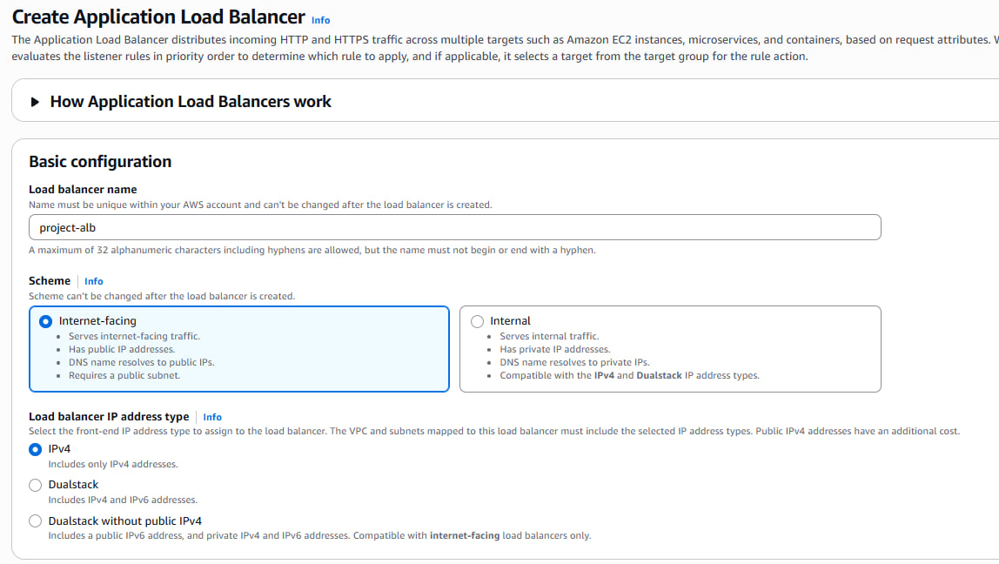


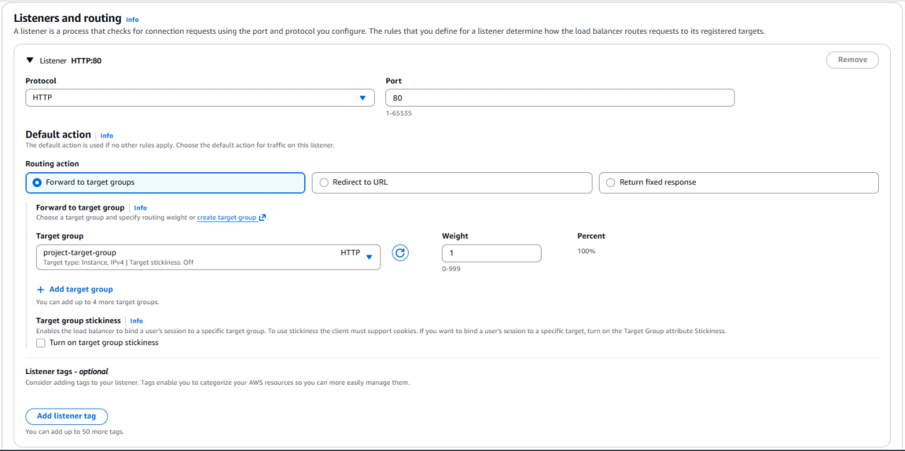

### Контрольный вопрос 4

**В чем разница между Internet-facing и Internal?**

* **Internet-facing** ALB имеет публичные IP-адреса, его DNS-имя резолвится в публичные адреса, и к нему можно обращаться из интернета.
* **Internal** ALB доступен только внутри VPC (через приватные IP). Он используется для внутреннего балансирования между сервисами, БД и т.п.

### Контрольный вопрос 5

**Что такое Default action и какие есть типы Default action?**

**Default action** — это действие, которое выполняет Listener, если входящий запрос не совпал ни с одним из пользовательских правил (по путям, хостам и т.д.).

Основные типы Default action:

* **Forward** — переслать запрос в Target Group (самый распространённый вариант, используется в данной работе);
* **Redirect** — перенаправить клиента на другой URL/протокол/порт (например, HTTP→HTTPS);
* **Fixed response** — вернуть фиксированный HTTP-ответ (код, тело, заголовки);
* **Authenticate** — выполнить аутентификацию через Cognito/OIDC перед дальнейшей обработкой.

## Шаг 7. Создание Auto Scaling Group

**Цель шага:** обеспечить автоматическое масштабирование веб-приложения в зависимости от нагрузки по CPU.

### 7.1. Создание Auto Scaling Group

1. Перейти в **EC2 → Auto Scaling Groups → Create Auto Scaling group**.
2. Basic configuration:

   * Name: `project-auto-scaling-group`
   * Launch template: `project-launch-template`
3. Network:

   * VPC: `project-vpc-lab6`
   * Subnets: **private-subnet-1a** и **private-subnet-1b**.
4. Load balancing:

   * Attach to an existing load balancer → выбрать существующую Target Group `project-target-group`.
5. Group size and scaling:

   * Desired capacity: 2
   * Minimum capacity: 2
   * Maximum capacity: 4
   * Scaling policy: **Target tracking scaling policy**
   * Metric type: Average CPU utilization
   * Target value: 50%
   * Instance warm-up: 60 секунд
6. Additional settings:

   * включить **Enable group metrics collection within CloudWatch**.
7. Нажать **Create Auto Scaling group**.

### Контрольный вопрос 6

**Почему для Auto Scaling Group выбираются приватные подсети?**

Инстансы в ASG выполняют роль backend-сервера и не должны быть напрямую доступны из интернета. Они получают трафик только от Application Load Balancer. Размещение в приватных подсетях:

* повышает безопасность (нет публичных IP и прямого входа);
* соответствует типичному продакшн-паттерну: Internet → ALB (public subnets) → EC2 (private subnets).

### Контрольный вопрос 7

**Зачем нужна настройка: Availability Zone distribution?**

Настройка **Availability Zone distribution** отвечает за равномерное распределение инстансов между зонами доступности (AZ):

* повышает отказоустойчивость (поломка одной AZ не «роняет» весь сервис);
* уменьшает задержки для пользователей из разных зон;
* помогает использовать ресурсы региона более сбалансированно.

### Контрольный вопрос 8

**Что такое Instance warm-up period и зачем он нужен?**

**Instance warm-up period** — это период времени после запуска нового инстанса, в течение которого:

* его метрики (например, CPU) **не учитываются** в расчёте средней нагрузки ASG;
* даётся время на загрузку ОС, старт приложений, прогрев кэшей и т.п.

Без warm-up период ASG могла бы неправильно интерпретировать низкую/высокую нагрузку на только что запущенном инстансе и масштабировать группу слишком агрессивно.

## Шаг 8. Тестирование Application Load Balancer

**Цель шага:** убедиться, что балансировщик корректно распределяет трафик между инстансами.

### 8.1. Проверка работы ALB

1. Перейти в **EC2 → Load Balancers → project-alb**.
2. Скопировать его **DNS name**, например:

   ```
   http://project-alb-xxxxxxxx.us-east-1.elb.amazonaws.com/
   ```
3. Открыть URL в браузере и несколько раз обновить страницу. При наличии нескольких инстансов в ASG на странице могут меняться hostname/instance-id (если они выводятся в приложении).

### Контрольный вопрос 9

**Какие IP-адреса вы видите и почему?**

При работе с ALB можно видеть два разных «набора» IP-адресов:

* при `ping`/`nslookup` DNS-имени ALB возвращаются **IP-адреса самих нод балансировщика** (их может быть несколько, т.к. ALB масштабируется горизонтально);
* внутри приложения можно увидеть **разные идентификаторы инстансов или hostname** — это означает, что ALB распределяет HTTP-запросы между зарегистрированными EC2-инстансами в Target Group.

Таким образом, пользователю «снаружи» всегда виден один DNS-адрес балансировщика, а внутренне запросы ходят на разные backend-серверы.

## Шаг 9. Тестирование Auto Scaling

**Цель шага:** искусственно создать нагрузку, чтобы ASG автоматически добавила новые инстансы, и зафиксировать этот процесс через CloudWatch.

### 9.1. Нагрузка через /load

1. В браузере открыть несколько вкладок с адресом:

   ```
   http://<DNS_ALB>/load?seconds=60
   ```

   или больше (например, 6–7 вкладок).
2. Каждое обращение к `/load` запускает тяжёлый PHP-скрипт, который создаёт высокую нагрузку на CPU в течение заданного времени.

### 9.2. Нагрузка через скрипт (при необходимости)

Можно использовать скрипт `curl.sh`, который запускает несколько параллельных запросов к `/load`.

### 9.3. Наблюдение за метриками и масштабированием

1. В **CloudWatch → Alarms** перейти к AlarmHigh, созданному для Target Tracking Policy.
2. Наблюдать за графиком **CPUUtilization** — при нагрузке он должен подняться выше 50%.
3. В разделе **EC2 → Auto Scaling Groups → project-auto-scaling-group → Activity** увидеть события:

   * `Launching a new EC2 instance` — признак того, что ASG приняла решение увеличить размер группы.
4. В **EC2 → Instances** убедиться, что количество инстансов увеличилось (например, с 2 до 3 или 4).

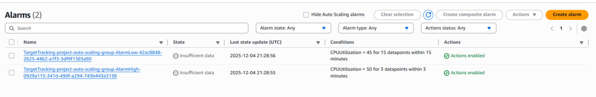

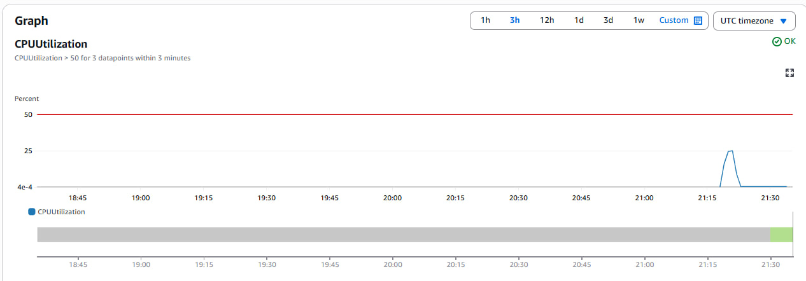


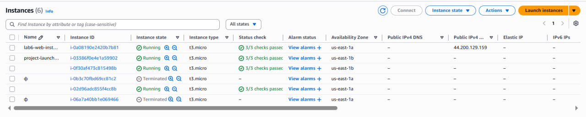

### Контрольный вопрос 10

**Какую роль в этом процессе сыграл Auto Scaling?**

Auto Scaling непрерывно отслеживает среднюю загрузку CPU по инстансам группы (через метрики CloudWatch). Когда нагрузка превысила целевой уровень 50%, сработал AlarmHigh, и Auto Scaling Group автоматически:

* запустила дополнительные EC2-инстансы по Launch Template;
* зарегистрировала их в Target Group;
* позволила ALB начать распределять часть трафика на новые инстансы.

Благодаря этому система смогла выдержать увеличенную нагрузку без ручного вмешательства и с сохранением доступности.

## Шаг 10. Завершение работы и очистка ресурсов

**Цель шага:** освободить все облачные ресурсы, чтобы прекратить начисление стоимости.

Последовательно выполняются действия:

1. Остановить нагрузочные тесты (закрыть вкладки браузера, остановить скрипты).
2. Удалить **Application Load Balancer**.
3. Удалить **Target Group**.
4. Удалить **Auto Scaling Group** (она сама завершит принадлежащие ей инстансы).
5. Проверить раздел **EC2 → Instances** и завершить оставшиеся тестовые инстансы, если они есть.
6. В разделе **AMIs** де-регистрировать `project-web-server-ami` и удалить связанные snapshots.
7. Удалить **Launch Template**.
8. При необходимости удалить VPC `project-vpc-lab6` и все связанные с ней подсети и ресурсы.

После этого инфраструктура полностью очищена.

# 5. Вывод

В ходе выполнения лабораторной работы была спроектирована и развернута отказоустойчивая и автоматически масштабируемая веб-инфраструктура в AWS. Были рассмотрены ключевые компоненты: VPC, EC2, AMI, Launch Template, Target Group, Application Load Balancer, Auto Scaling Group и CloudWatch.

Система успешно прошла нагрузочное тестирование: при увеличении нагрузки Auto Scaling автоматически добавлял новые инстансы, а ALB распределял трафик между ними. Размещение backend-инстансов в приватных подсетях обеспечило дополнительный уровень безопасности. Все ресурсы в конце работы были корректно удалены.

Лабораторная работа позволила на практике закрепить важные концепции DevOps и архитектуры облачных решений.

# 6. Список использованных источников

* Официальная документация AWS по EC2, Auto Scaling, Elastic Load Balancing и CloudWatch.
* Методические указания по лабораторной работе №6.
* Материалы курса по дисциплине DevOps.
