# Лабораторная работа №5 — Облачные базы данных: Amazon RDS, Read Replica, EC2

**Выполнил:** Mihailov Piotr  
**Группа:** I2302

## Цель работы

Ознакомление с облачными реляционными БД в AWS (Amazon RDS/MySQL) и их возможностями:

- создание и настройка экземпляров реляционных БД в облаке;
- понимание концепции Read Replica и её применения для масштабирования и отказоустойчивости;
- подключение к RDS с виртуальной машины EC2;
- выполнение базовых операций CRUD через SQL;
- разработка простого CRUD веб‑приложения, работающего с RDS.

## Формулировка задачи

Необходимо:

- Создать VPC с двумя публичными и двумя приватными подсетями в разных AZ, настроить Security Groups.
- Создать DB Subnet Group, развернуть экземпляр Amazon RDS MySQL.
- Создать виртуальную машину EC2 в публичной подсети, настроить MySQL‑клиент.
- Подключиться с EC2 к RDS, создать 2 связанные таблицы, вставить данные, выполнить JOIN.
- Создать Read Replica, подключиться к ней, ответить на контрольные вопросы (видимость данных, возможность записи, репликация).
- Развернуть простое CRUD веб‑приложение (вариант 6a) на EC2, подключающееся к RDS.

## Теоретическая часть

### Amazon VPC, подсети

Amazon VPC (Virtual Private Cloud) — виртуальная изолированная сеть в AWS, в которой создаются подсети, таблицы маршрутов, интернет‑шлюзы и др.

- **Публичные подсети** — ресурсы с доступом в интернет (EC2, bastion).
- **Приватные подсети** — внутренние ресурсы (RDS, внутренние сервисы).

### Security Group

Security Group (SG) — виртуальный межсетевой экран уровня инстанса. Для каждого инстанса задаются правила входящего и исходящего трафика.

### Amazon RDS MySQL

Amazon RDS — управляемый сервис для реляционных БД (MySQL, PostgreSQL, MariaDB и др.). Возможности:

- автоматические бэкапы и восстановление;
- управление масштабированием и хранением;
- обновление версий и патчей;
- поддержка Read Replicas.

### Read Replica

Read Replica — копия основной базы данных, на которую данные реплицируются асинхронно. Применение:

- разгрузка основного инстанса по запросам чтения;
- отчёты и аналитика;
- повышение отказоустойчивости (реплику можно повысить до master при аварии).


## Практическая часть

### Шаг 1. Подготовка среды (VPC / подсети / Security Groups)

#### 1.1. Создание VPC и подсетей

**VPC:** `project-vpc`  
**CIDR:** `10.0.0.0/16`

Созданы 4 подсети в разных зонах доступности:

- Публичная подсеть A: `10.0.0.0/20` (AZ *a*)  
- Публичная подсеть B: `10.0.16.0/20` (AZ *b*)  
- Приватная подсеть A: `10.0.128.0/20` (AZ *a*)  
- Приватная подсеть B: `10.0.144.0/20` (AZ *b*)

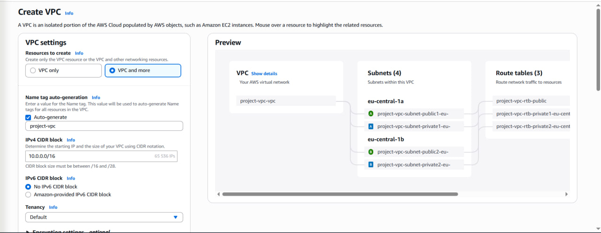

#### 1.2. Создание Security Groups

**web-security-group**  
**Входящие:**

- HTTP — порт `80`, источник: `0.0.0.0/0`;
- SSH — порт `22`, источник: *мой IP* / `0.0.0.0/0` (учебно).

**Исходящие:** по умолчанию — всё разрешено. Логически используем исходящий MySQL/Aurora порт `3306` → `db-mysql-security-group`.

**db-mysql-security-group**  
**Входящие:**

- MySQL/Aurora — порт `3306`, источник: `web-security-group` (только приложения из этого SG).

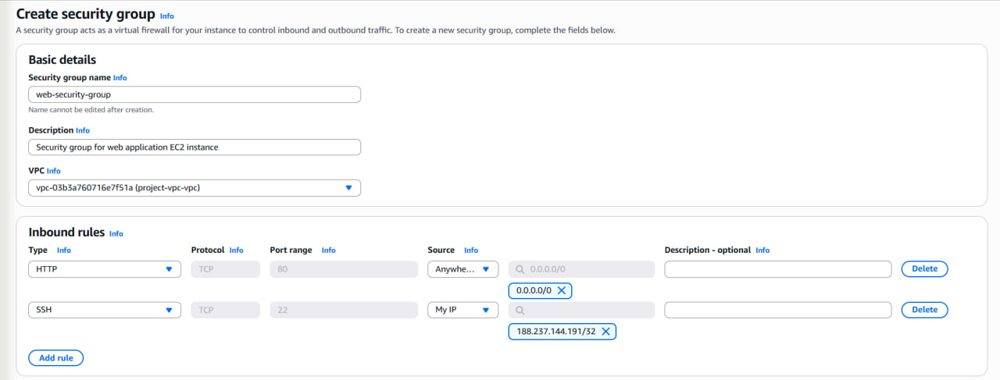

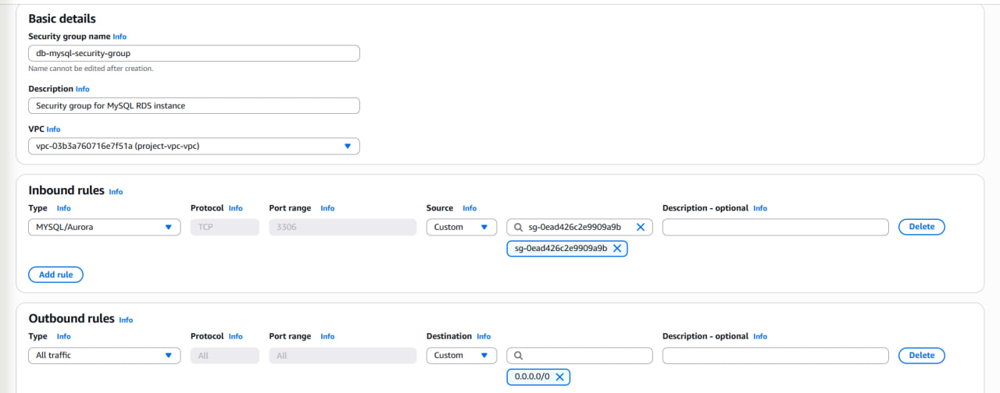

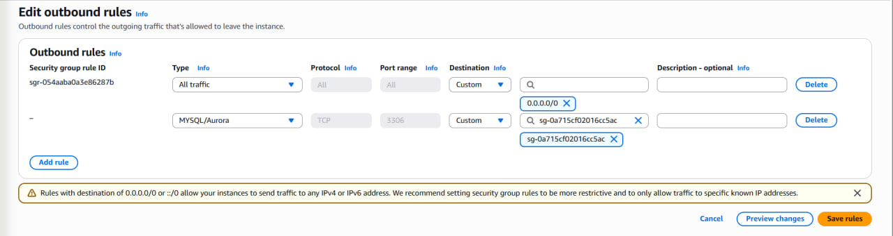

### Шаг 2. Развёртывание Amazon RDS

#### 2.1. Создание DB Subnet Group

RDS → **Subnet groups** → *Create DB subnet group*

- **Name:** `project-rds-subnet-group`
- **VPC:** `project-vpc`
- **Subnets:** приватные `Private Subnet A` и `Private Subnet B` (разные AZ).

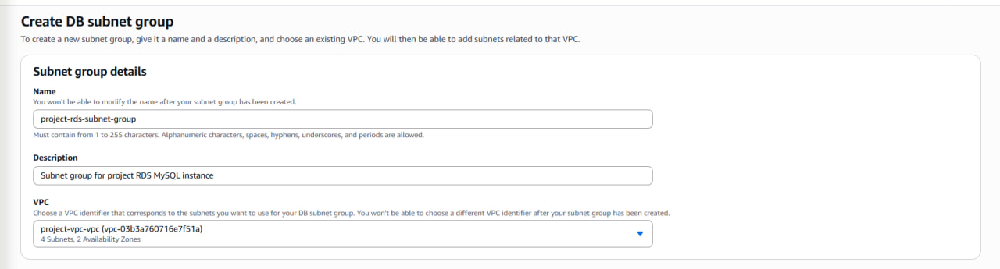

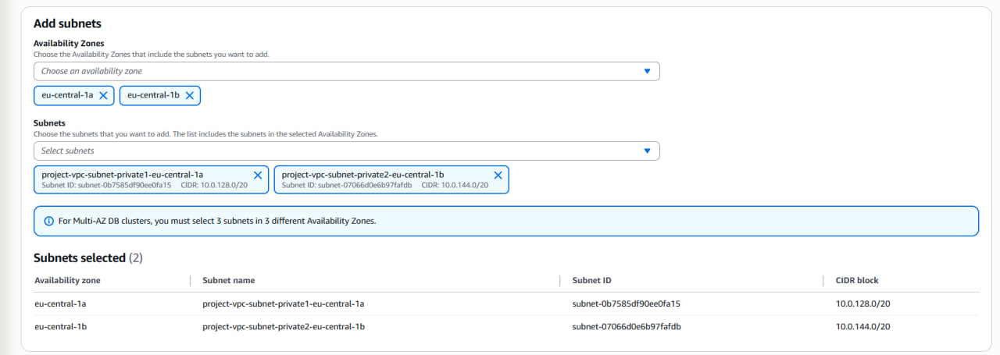

**Контрольный вопрос:** *Что такое Subnet Group и зачем она БД?*

**Ответ:** DB Subnet Group — логическая группировка подсетей в VPC, где разрешено размещать экземпляры RDS. Нужна, чтобы:

- указать приватные подсети для БД;
- обеспечить высокую доступность (подсети в разных AZ);
- связать БД с нужной VPC.  
Без Subnet Group RDS не знает, где размещать БД.

#### 2.2. Создание экземпляра Amazon RDS MySQL

RDS → **Databases** → *Create database*

- **Database creation method:** Standard Create
- **Engine type:** MySQL (версия 8.0.42)
- **Template:** Free tier
- **Availability and durability:** Single-AZ
- **Settings:**  
  `DB instance identifier: project-rds-mysql-prod`  
  `Master username: admin`  
  `Master password: <сохранён>`
- **DB instance class:** `db.t3.micro` (burstable)
- **Storage:** `gp3`, 20 GB, autoscaling до 100 GB
- **Connectivity:**  
  `VPC: project-vpc` • `DB subnet group: project-rds-subnet-group` • `Public access: No` • `VPC SG: db-mysql-security-group`
- **AZ:** No preference
- **Additional configuration:**  
  `Initial database name: project_db` • Backups ✔ • Encryption ✖ • Auto minor upgrade ✖

После создания в **Connectivity & security** скопирован **Endpoint**, напр.:  
`database-1.cbym68mi6jua.eu-central-1.rds.amazonaws.com`

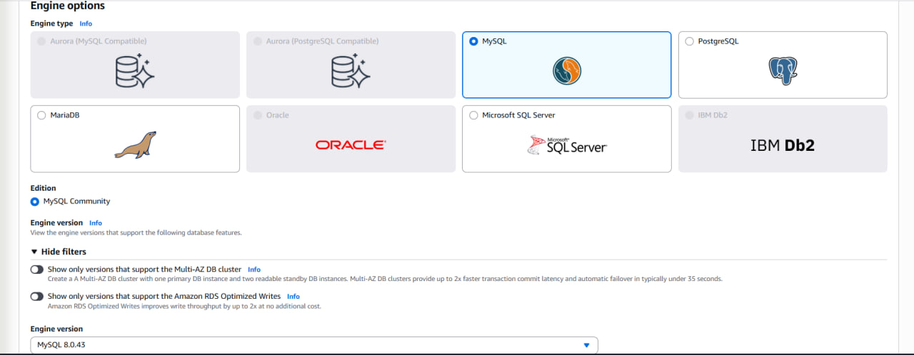

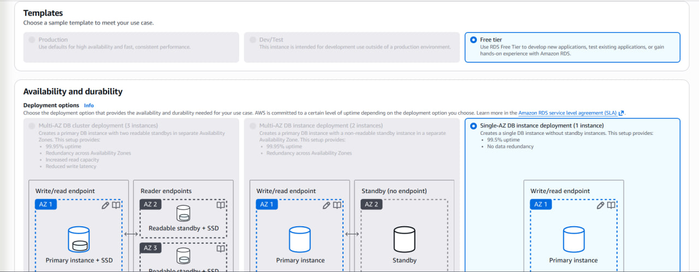

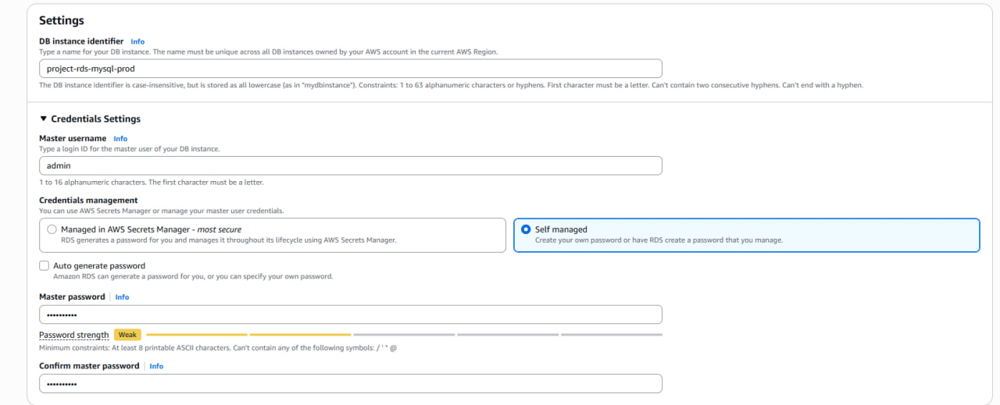

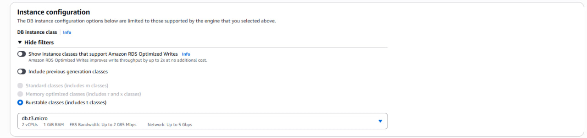

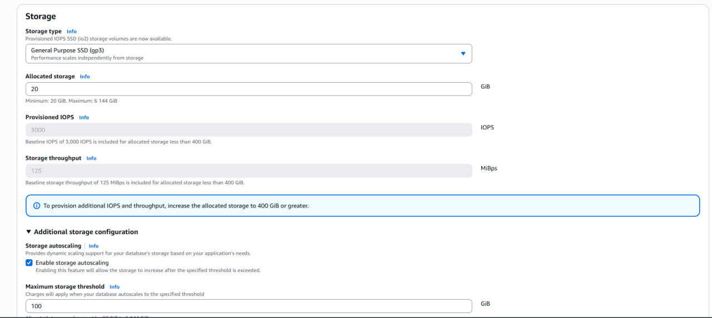

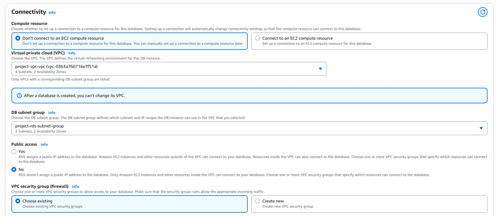

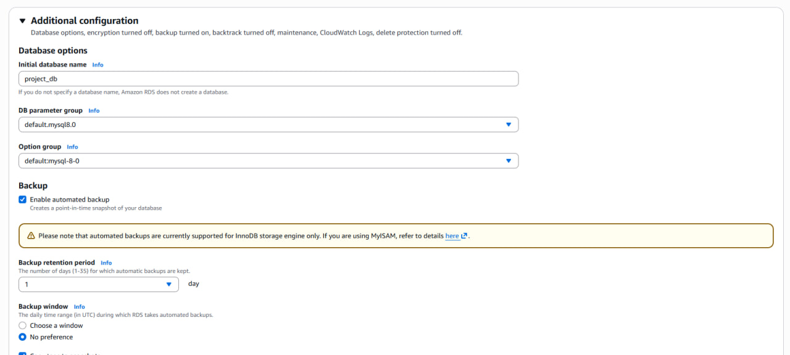

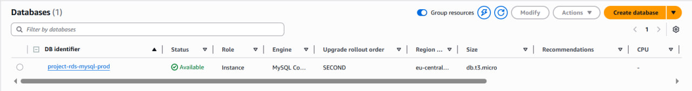

### Шаг 3. ВМ EC2 для подключения к RDS

- **AMI:** Amazon Linux 2023
- **Instance type:** `t2.micro` / `t3.micro` (free tier)
- **VPC/Subnet:** `project-vpc`, публичная подсеть A
- **Security group:** `web-security-group`

**User data:**
```bash
#!/bin/bash
dnf update -y
dnf install -y mariadb105
```

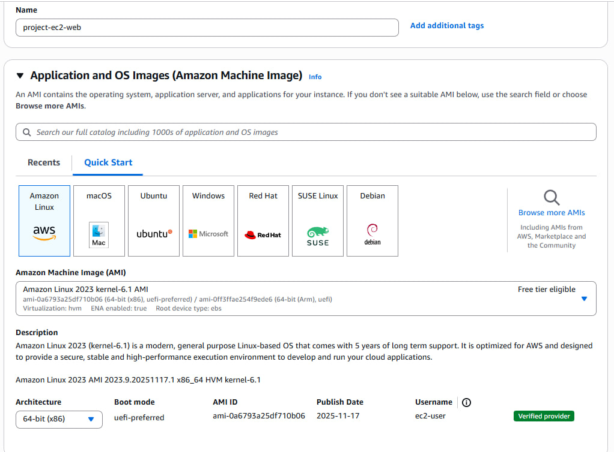

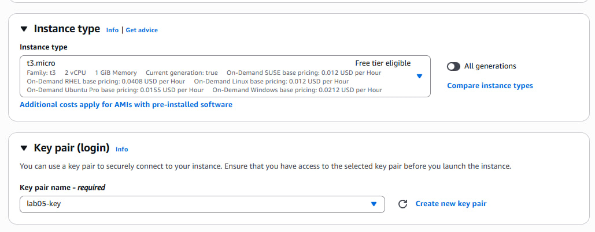

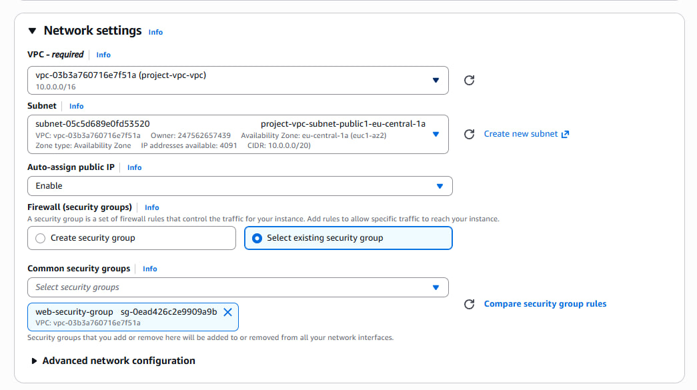

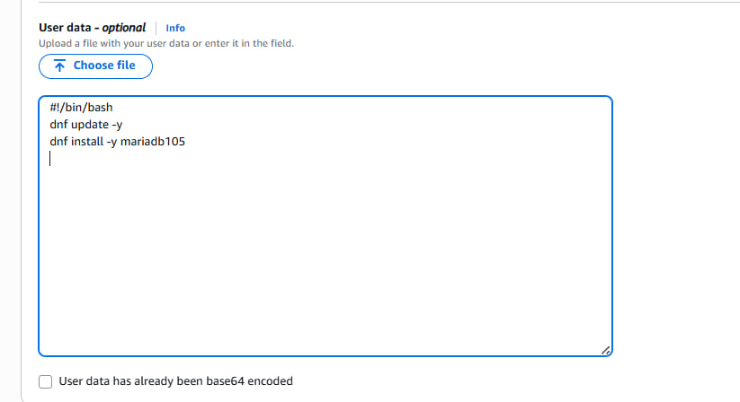

Подключение по SSH:
```bash
ssh -i lab05-key.pem ec2-user@<EC2_PUBLIC_IP>
```
### Шаг 4. Подключение к БД и базовые операции

#### 4.1. Подключение с EC2 к RDS
```bash
mysql -h database-1.cbym68mi6jua.eu-central-1.rds.amazonaws.com -u admin -p
```

Выбор базы:

```sql
USE project_db;
```

#### 4.2. Создание двух таблиц (1→N)

```sql
CREATE TABLE categories (
    id   INT AUTO_INCREMENT PRIMARY KEY,
    name VARCHAR(255) NOT NULL
);

CREATE TABLE todos (
    id          INT AUTO_INCREMENT PRIMARY KEY,
    title       VARCHAR(255) NOT NULL,
    category_id INT,
    status      ENUM('pending','in_progress','done') DEFAULT 'pending',
    FOREIGN KEY (category_id) REFERENCES categories(id)
);
```

#### 4.3. Вставка данных

```sql
INSERT INTO categories (name)
VALUES ('Дом'), ('Работа'), ('Учёба');

INSERT INTO todos (title, category_id, status) VALUES
('Помыть посуду', 1, 'pending'),
('Сделать отчёт', 2, 'in_progress'),
('Сдать лабораторную №5', 3, 'done');
```

#### 4.4. SELECT и JOIN

```sql
SELECT * FROM categories;
SELECT * FROM todos;

SELECT 
    t.id,
    t.title,
    t.status,
    c.name AS category
FROM todos t
JOIN categories c ON t.category_id = c.id;
```

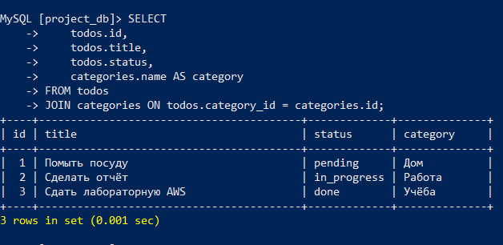

### Шаг 5. Создание Read Replica

#### 5.1. Создание Read Replica в консоли

RDS → **Databases** → выбрать `project-rds-mysql-prod` → *Actions → Create read replica*

- **DB instance identifier:** `project-rds-mysql-read-replica`
- **Instance class:** `db.t3.micro`
- **Storage:** `gp3`
- **Enhanced monitoring:** ✖
- **Public access:** No
- **VPC security groups:** `db-mysql-security-group`

После создания: endpoint, напр.:  
`project-rds-mysql-read-replica.cbym68mi6jua.eu-central-1.rds.amazonaws.com`

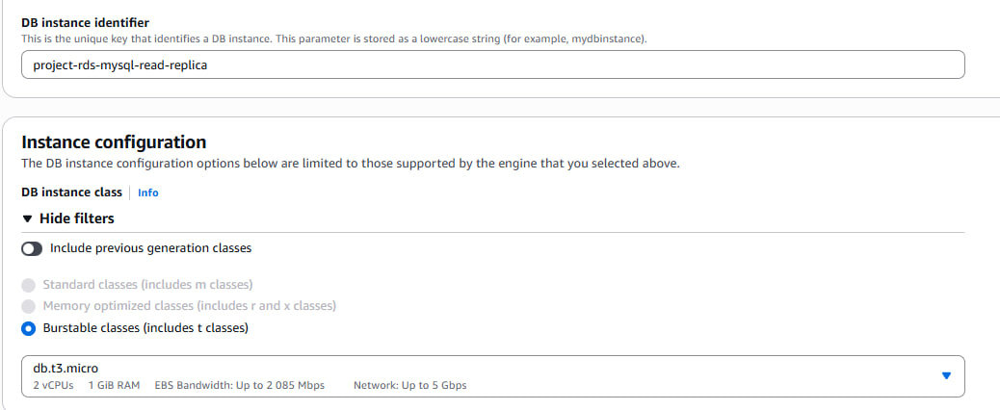

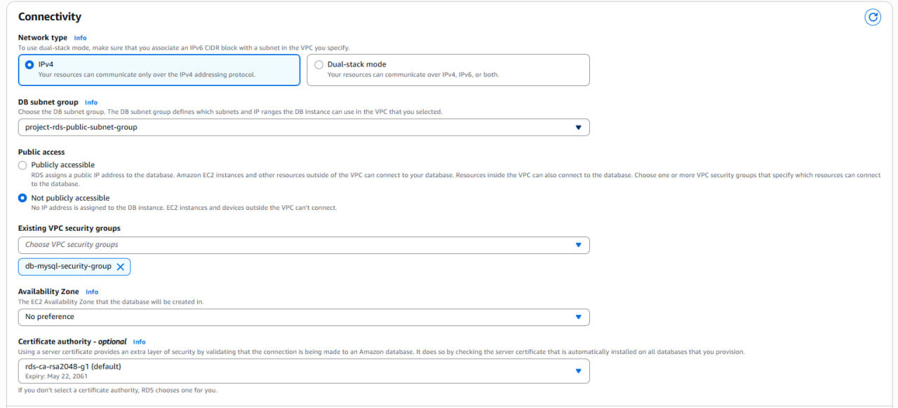

#### 5.2. Подключение к Read Replica и контрольные вопросы

Подключение:

```bash
mysql -h project-rds-mysql-read-replica.cbym68mi6jua.eu-central-1.rds.amazonaws.com -u admin -p
USE project_db;
```

Выборка:

```sql
SELECT 
    t.id,
    t.title,
    t.status,
    c.name AS category
FROM todos t
JOIN categories c ON t.category_id = c.id;
```

**Вопрос:** *Какие данные видны? Почему?*  
**Ответ:** Те же данные, что и на master, так как используется асинхронная репликация изменений.

Проверка записи на реплике:

```sql
INSERT INTO categories (name) VALUES ('Попытка записи с реплики');
-- ERROR 1290 (HY000): The MySQL server is running with the --read-only option
```

**Вопрос:** *Получилось ли выполнить запись? Почему?*  
**Ответ:** Нет, реплика в режиме **read‑only**, записи запрещены.

Добавление записи на master:

```bash
mysql -h database-1.cbym68mi6jua.eu-central-1.rds.amazonaws.com -u admin -p
USE project_db;
INSERT INTO categories (name) VALUES ('Новая категория с master');
```

Проверка на реплике:

```sql
SELECT * FROM categories;
```

**Вопрос:** *Отобразилась ли запись на реплике? Почему?*  
**Ответ:** Да, после небольшой задержки из‑за асинхронной репликации.

**Вопрос:** *Зачем нужны Read Replicas?*  
**Ответ:** Для масштабирования чтения, разгрузки master, аналитики/отчётов без влияния на производительность, а также повышения отказоустойчивости (promotion при сбое).

### Шаг 6. CRUD веб‑приложение (вариант 6a, PHP)

#### 6.1. Установка Apache и PHP на EC2

```bash
sudo dnf install -y httpd php php-mysqlnd
sudo systemctl enable httpd
sudo systemctl start httpd

cd /var/www/html
mkdir crud-app
cd crud-app
```

#### 6.2. `db.php` (подключение к RDS)

```php
<?php
$host = "database-1.cbym68mi6jua.eu-central-1.rds.amazonaws.com";
$user = "admin";
$pass = "ВАШ_ПАРОЛЬ";
$db   = "project_db";

$conn = new mysqli($host, $user, $pass, $db);

if ($conn->connect_error) {
    die("Ошибка подключения: " . $conn->connect_error);
}
?>
```

#### 6.3. `index.php` (чтение списка задач)

```php
<?php
require "db.php";

$result = $conn->query("
    SELECT todos.id, todos.title, todos.status, categories.name AS category
    FROM todos
    JOIN categories ON todos.category_id = categories.id
");
?>
<h1>TODO List</h1>
<a href="create.php">Добавить задачу</a><br><br>

<?php while ($row = $result->fetch_assoc()): ?>
    <b><?= htmlspecialchars($row['title']) ?></b>
    (<?= htmlspecialchars($row['category']) ?>) - <?= htmlspecialchars($row['status']) ?>
    <a href="edit.php?id=<?= $row['id'] ?>">[редактировать]</a>
    <a href="delete.php?id=<?= $row['id'] ?>">[удалить]</a>
    <br>
<?php endwhile; ?>
```

#### 6.4. `create.php` (создание новой задачи)

```php
<?php
require "db.php";

if ($_SERVER['REQUEST_METHOD'] === 'POST') {
    $title    = $_POST['title'];
    $category = $_POST['category_id'];
    $status   = $_POST['status'];

    $conn->query("
        INSERT INTO todos (title, category_id, status)
        VALUES ('$title', '$category', '$status')
    ");

    header("Location: index.php");
    exit();
}

$categories = $conn->query("SELECT * FROM categories");
?>
<h2>Добавить задачу</h2>
<form method="POST">
    <input name="title" placeholder="Название задачи" required><br>

    <select name="category_id">
        <?php while ($c = $categories->fetch_assoc()): ?>
            <option value="<?= $c['id'] ?>"><?= htmlspecialchars($c['name']) ?></option>
        <?php endwhile; ?>
    </select><br>

    <select name="status">
        <option value="pending">pending</option>
        <option value="in_progress">in_progress</option>
        <option value="done">done</option>
    </select><br>

    <button type="submit">Создать</button>
</form>
```

#### 6.5. `edit.php` (редактирование задачи)

```php
<?php
require "db.php";

$id = (int)$_GET['id'];

if ($_SERVER['REQUEST_METHOD'] === 'POST') {
    $title  = $_POST['title'];
    $status = $_POST['status'];

    $conn->query("
        UPDATE todos
        SET title = '$title', status = '$status'
        WHERE id = $id
    ");

    header("Location: index.php");
    exit();
}

$todo = $conn->query("SELECT * FROM todos WHERE id = $id")->fetch_assoc();
?>
<h2>Редактировать задачу</h2>
<form method="POST">
    <input name="title" value="<?= htmlspecialchars($todo['title']) ?>"><br>

    <select name="status">
        <option value="pending"     <?= $todo['status']=='pending'?'selected':'' ?>>pending</option>
        <option value="in_progress" <?= $todo['status']=='in_progress'?'selected':'' ?>>in_progress</option>
        <option value="done"        <?= $todo['status']=='done'?'selected':'' ?>>done</option>
    </select><br>

    <button type="submit">Сохранить</button>
</form>
```

#### 6.6. `delete.php` (удаление задачи)

```php
<?php
require "db.php";

$id = (int)$_GET['id'];

$conn->query("DELETE FROM todos WHERE id = $id");

header("Location: index.php");
exit();
```
Открыть в браузере:  
`http://<EC2_PUBLIC_IP>/crud-app/index.php`

Доступно: создание, редактирование и удаление задач.

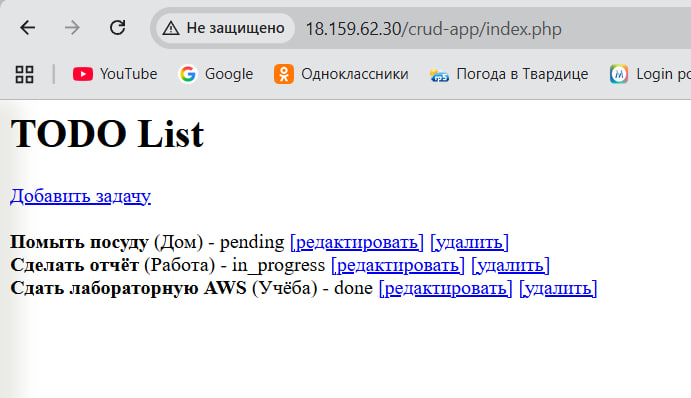

## Вывод

Выполнены:

- настройка сети AWS: VPC, публичные и приватные подсети, Security Groups;
- создание и конфигурация Amazon RDS MySQL;
- подключение к БД с EC2;
- создание таблиц `categories` и `todos`, операции CRUD и запросы с JOIN;
- создание и проверка Read Replica, ответы на вопросы по репликации;
- развёртывание простого PHP CRUD‑приложения, работающего с RDS.

Практически освоены базовые принципы построения облачной архитектуры с Amazon RDS и EC2, а также применение Read Replicas для масштабирования чтения.
